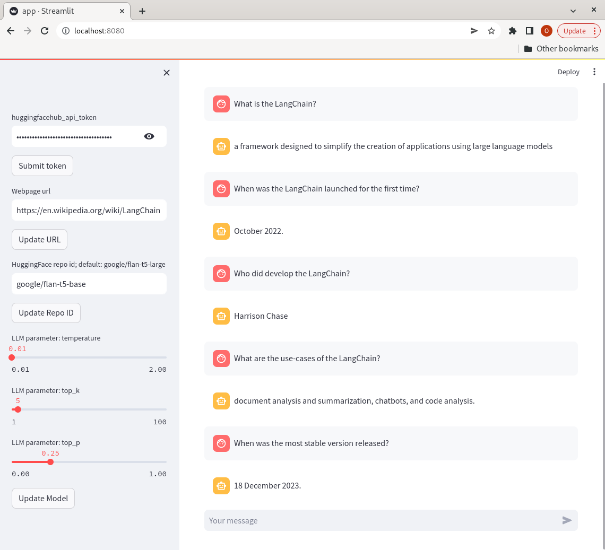

# RAG-Chatbot
## Retrieval Augmented Generation Chatbot

This repository hosts a user-friendly chatbot that employs the HuggingFace and Langchain libraries, along with FastAPI for the API, Streamlit for the webpage interface, and Nginx as the web server.

## Getting Started

### Prerequisites
Ensure Docker and Docker Compose are installed on your system.

### Running the Application
1. Clone the repository:
    ```bash
    git clone git@github.com:omidmns/RAG-chatbot.git
    cd RAG-chatbot
    ```

2. Start the application in a local mode using Docker Compose:
    ```bash
    docker-compose -f docker-compose.test.yaml up
    ```

3. Access the application at `localhost:8080`.

## Usage

To interact with the chatbot, you'll need a HuggingFace API token. Provide this token when prompted. Additionally, input the URL of a webpage, such as a Wikipedia page, to initialize the model with information. Begin typing your questions, and the model will generate responses based on the content of the provided URL.

See the example image below for a visual representation of questions and answers when using the application with the URL [LangChain](https://en.wikipedia.org/wiki/LangChain) (last access Jan 02, 2024).


<br> 

The default model is `google/flan-t5-large`. You can change it by providing the HuggingFace `repo_id` to the application.

Feel free to explore different functionalities and experiment with diverse inputs to enhance the chatbot's performance.

## Acknowledgments

This project relies on the following libraries and frameworks:
- [HuggingFace](https://huggingface.co/)
- [Langchain](https://langchain.com/)
- [FastAPI](https://fastapi.tiangolo.com/)
- [Streamlit](https://streamlit.io/)
- [Nginx](https://www.nginx.com/)

